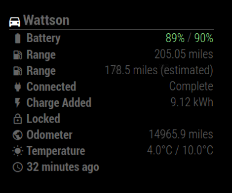

# MMM-OpenSprinkler

This an extension for the [MagicMirror](https://github.com/MichMich/MagicMirror).

It monitors a your Sprinkler Stats, such as Stations, Programs, Water Level, Rain Delay and much more! 

I am happy to accept any [bug reports](https://github.com/johnncy-co/MMM-OpenSprinkler/issues) or [pull requests](https://github.com/johnny-co/MMM-OpenSprinkler/pulls) for new features or fixes.

## Screenshot



## Installation

Open a terminal session, navigate to your MagicMirror's `modules` folder and execute `git clone https://github.com/johnny-co/MMM-OpenSprinkler.git`, a new folder called MMM-OpenSprinkler will be created.

Activate the module by adding it to the config.js file as shown below. Of course the position is up to you.

## Notes

### Config Options

Will add detail, no options needed to run off demo (demo.opensprinkler.com)
| Option | Details | Example |
| --- | --- | --- |
| osName | Sprinkler name to display | 'Sprinklers' |
| osIP | Open Sprinkler IP can be an IP address or hostname | 'demo.opensprinkler.com' |
| osPassword | Open Sprinkler (cleartext) password | 'opendoor' |
| --- | --- | --- |
| items | The rows of data you want the module to show. See list below. By default will show all available | '[ 'sun', 'raindelay', 'waterlevel', 'programrunning', 'sn' ]',


### Available fields

| Field name | Data display |
| --- | --- |
| sun | Show sunrise and sunset |
| raindelay | Display if rain delay is in place |
| waterlevel | water level % based on weather |
| programrunning | Display which program is running or On demand or Run-once |
| sn | Open and queued stations |
| stationlist | Display all stations |


* Some fields (stations) are only enabled if the station is open (on)

## Future work

* lots and lots


## Credits

* Thanks to [Matt Dyson](https://github.com/mattdy) for the [original version](https://github.com/f00d4tehg0dz/MMM-TeslaFi)

## Using the module

````javascript
modules: [
		{
			module:		'MMM-OpenSprinkler',
			position:	'top_right',
			config: {
				osName: 'Castle Lawn Service',
				osIP: 'demo.opensprinkler.com',
				osPassword: 'opendoor',
				items: [ 'sun', 'raindelay', 'waterlevel', 'programrunning', 'sn' ],
			}
		},
]
````
